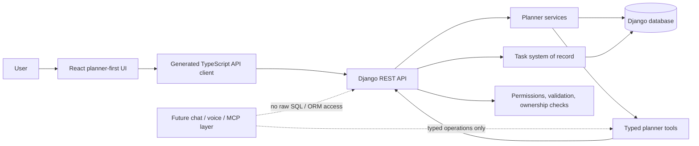
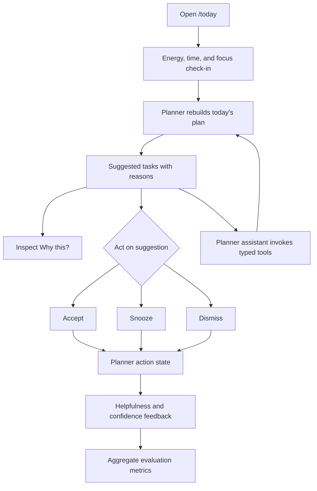

# "What Should I Do Today?": A Planner-First Productivity Tracker Using Just-in-Time UI and Typed Planner Operations

## Abstract

This capstone implements a planner-first reinterpretation of the original WSIDT
software requirements specification (SRS), a web-based task-management and
productivity-tracking system for the University of the Philippines Open
University (UPOU) community. The implementation preserves task management as a
system of record, then focuses the capstone contribution on the daily planning
question raised by Crisanto's study: "What should I do today?" [CITATION:
Crisanto]. The prototype uses task data, due dates, priority, recurrence,
energy level, available time, focus mode, suggestion reasons, and user feedback
to generate an explainable daily planning surface. The project treats
generative UI as controlled just-in-time UI: the system selects from registered
React planner components and calls typed Django backend operations, rather than
generating arbitrary frontend code or giving an assistant raw database access.
Evaluation is designed as a walkthrough with UPOU faculty and staff, measuring
helpfulness, confidence, explanation quality, suggestion actions, and
privacy-preserving aggregate evidence.

## 1. Introduction

Task-management systems help users record work, deadlines, priorities, and
projects. However, a stored task list does not automatically answer the more
practical daily planning question: what should the user do now? For faculty and
staff, this decision often requires balancing teaching, research,
administrative work, deadlines, available time, and current energy.

This capstone builds on the original WSIDT SRS, which described a web-based
task-management and productivity-tracking application for the UPOU community.
The current implementation does not discard that SRS. Instead, it preserves the
generic task-management foundation and focuses the main contribution on
planner-first decision support.

The central claim of this capstone is:

```text
A planner-first productivity tracker can better address the "What should I do
today?" problem when it uses task data, due dates, priority, recurrence, energy,
available time, and user feedback to generate a just-in-time planning interface
instead of showing only a static task list.
```

The project therefore treats task management as the system of record and daily
planning as the differentiating layer. The implemented `/today` experience asks
for the user's current planning context, recommends tasks with reasons, allows
accept, snooze, and dismiss actions, and captures feedback for aggregate
evaluation.

## 2. Background And Source Study

Crisanto's study, `"What should I do today?" A Case Study on the Current
Practices and Software Requirements Specification of a Web-Based Planner and
Productivity Tracker`, provides the requirements grounding for this capstone.
The source study focused on UPOU employees, including faculty, research
assistants, and staff [CITATION: Crisanto]. That scope matters because the
current prototype should be validated primarily against faculty and staff
planning needs. Student use cases may be adjacent or future work, but they are
not the primary validated scope for this version.

The study title foregrounds a planning problem rather than a storage problem.
Users may already have tools for recording tasks, calendar events, or goals,
but they still face the daily decision of what work deserves attention. The
capstone therefore reframes the product around decision support:

```text
Generic task app:
"What tasks do I have?"

Planner-first app:
"Given my tasks, deadlines, energy, and available time, what should I do today?"
```

The implementation uses this distinction to avoid becoming another generic
Todoist or Trello clone. The project still includes task-management features,
but the main research and design contribution is the planner-first layer.

## 3. Requirements And SRS Reconciliation

The original ReadySET SRS describes WSIDT as a broad task-management and
productivity-tracking tool. Its feature set includes user registration, site
configuration, task configuration, personal scheduling, reminders, suggested
tasks, productivity reports, energy tracking, device syncing, application
integration, an admin area, and a possible voice or conversational interface.

The current implementation supports much of the baseline product surface:

- task, project, section, tag, due-date, priority, recurrence, completion, and
  ordering behavior
- Today, Upcoming, Inbox, project, productivity, settings, and admin surfaces
- notifications and email digest behavior
- comments with task ownership boundaries
- generated API client and tested Django REST Framework endpoints
- aggregate admin and planner evaluation reporting

However, the capstone contribution is intentionally narrower than the full SRS.
The strongest requirement for the source-study problem is `F-12 Suggested
tasks`, supported by related requirements for personal scheduling, productivity
analytics, and energy tracking. In this implementation, suggested tasks become
an explainable daily planner. Energy tracking becomes a planning input, not
only a retrospective report. Productivity analytics become aggregate evaluation
metrics, not surveillance over individual task content.

The SRS reconciliation therefore follows this rule:

```text
The existing task system provides trusted task data. The innovation is not more
task CRUD, but the daily planning layer that helps users decide what to do next.
```

Deferred features, such as full Google Calendar sync, group scheduling,
motivation systems, and full chat or voice control, are treated as future work.
They are not required to defend the planner-first MVP.

Table 1 summarizes the SRS items most directly connected to the capstone
contribution.

| SRS area                       | Current implementation                                                                                               | Capstone interpretation                                                                                  |
| ------------------------------ | -------------------------------------------------------------------------------------------------------------------- | -------------------------------------------------------------------------------------------------------- |
| Suggested tasks                | `TodayPlan` and `PlanItem` generate ordered recommendations with reasons, task signals, estimates, and action state. | Main capstone contribution: the generic suggested-task requirement becomes an explainable daily planner. |
| Personal scheduling            | Due dates, recurrence, Today/Upcoming views, available minutes, and time-fit planner modes are implemented.          | Scheduling is used as planning context rather than as a full calendar replacement.                       |
| Productivity report            | Productivity views and admin-only aggregate planner evaluation metrics are implemented.                              | Reporting supports evaluation through aggregate helpfulness, confidence, and suggestion action rates.    |
| Energy tracking                | `EnergyCheckIn` captures energy, available minutes, focus mode, and context.                                         | Energy and time become just-in-time planning inputs, not only retrospective logs.                        |
| Google Calendar integration    | Deferred.                                                                                                            | Calendar should become opt-in scheduling context or sync, not the primary task backend.                  |
| Voice/conversational interface | Deferred as a full interface; typed planner tools and assistant demo panel exist.                                    | Future chat, voice, or MCP layers should call typed backend operations only.                             |

## 4. System Design

The target architecture is Option 1.5:

- Django and Django REST Framework own state, permissions, validation,
  ownership checks, and audit-friendly state transitions.
- React renders the planner-first experience.
- Future chat, voice, or MCP-style interfaces call typed backend operations.
- The assistant layer never receives raw SQL, unrestricted ORM access, or
  arbitrary database mutation rights.

Figure 1 shows the target architecture.



This architecture supports controlled generative UI. In this project,
generative UI does not mean that an AI model generates arbitrary JSX, CSS, SQL,
or executable frontend code. Instead, the system generates structured planning
decisions, such as which planner mode should be shown and which suggestion IDs
belong in the shortlist. React then renders only known components from a fixed
component registry.

Key terms used in the design are:

- **Human-Computer Interaction (HCI)**: the study of how people use software
  and whether a system is understandable, useful, efficient, trustworthy, and
  aligned with real user needs.
- **Generative UI**: an interface pattern where the system adapts the UI based
  on user context or intent.
- **Just-in-time UI**: UI that appears when relevant to the user's current
  situation, such as a low-energy planning card when the user reports low
  energy.
- **Typed operation**: a predefined backend action with named inputs,
  validation, permissions, and predictable side effects.
- **Component registry**: a fixed list of frontend components the planner is
  allowed to render.
- **UI schema**: structured data that tells the frontend which registered
  component to render and what planner state it should use.
- **Grounding**: ensuring suggestions come from real task data, due dates,
  priorities, check-ins, and other app state rather than invented tasks.

The current just-in-time planner modes include default daily plan, low-energy
plan, limited-time plan, overdue triage, and unavailable planner state. These
modes allow the same task data to produce different planning surfaces depending
on the user's current situation.

Figure 2 shows the planner-first flow evaluated in the walkthrough.



## 5. Implementation

The implementation includes both a baseline task-management system and a
planner-first layer.

The baseline task system includes projects, sections, tasks, tags, recurrence,
notifications, email digest behavior, comments, productivity views, admin
views, generated API client support, and tests. Before adding the planner
features, security and privacy fixes hardened profile updates, task ownership,
comment ownership, daily digest triggering, admin reporting boundaries, and
production settings.

The planner-specific backend includes:

- `EnergyCheckIn`: daily energy level, available minutes, focus mode, and
  optional context
- `TodayPlan`: the generated plan for a user and date
- `PlanItem`: ordered task suggestions with reason, estimate, score, task
  signals, and action status
- `TodayPlanFeedback`: helpfulness rating, confidence rating, and optional note
- planner scoring logic using due status, priority, recurrence, estimated
  effort, project context, and previous snooze or dismiss history
- aggregate planner evaluation metrics

The planner API exposes typed endpoints and operations, including:

- `GET /api/planner/today/`
- `POST /api/planner/check-in/`
- `POST /api/planner/rebuild/`
- suggestion accept, snooze, and dismiss endpoints
- `POST /api/planner/feedback/`
- `GET /api/planner/evaluation/`
- `GET /api/planner/tools/`
- `POST /api/planner/tools/{tool_name}/invoke/`

The frontend implementation makes `/today` planner-first. It renders the energy
and time check-in, planner suggestions, reason details, task-signal breakdowns,
planner mode highlights, feedback controls, and the normal task list below the
planner surface. The frontend also includes `PlannerAssistantCard`, a
deterministic assistant demo panel that discovers the typed planner tool
catalog and invokes canned planner operations such as showing the current plan,
refreshing the plan, or switching to low-energy mode.

The assistant panel is not a full chat interface. It is a safe bridge toward
future chat, MCP, or voice interfaces because it demonstrates that an assistant
can call named backend tools without gaining raw database access.

Figure 3 should be a screenshot of the `/today` planner dashboard for final
submission. It should show the check-in, suggested tasks, reason controls, mode
highlights, feedback card, and `PlannerAssistantCard`. The screenshot should be
captured from seeded demo data or a privacy-safe account, not from a real
participant account with identifying task content.

## 6. Evaluation Method

The evaluation is designed to measure the planning claim, not broad
organizational productivity improvement. The key evaluation question is whether
the planner-first prototype helps UPOU faculty and staff decide what to work on
next.

The evaluation uses a guided walkthrough. Participants or reviewers open
`/today`, complete or update the energy/time/focus check-in, review suggested
tasks, inspect at least one suggestion reason, act on suggestions through
accept, snooze, or dismiss, use the planner assistant panel, and submit
helpfulness and confidence feedback.

The planned measures are:

- helpfulness rating
- confidence rating
- whether a next task was clear
- whether the suggestion reason was understood
- accept, snooze, and dismiss actions
- whether the planner assistant's typed operations were understandable
- qualitative friction points and missing context

Privacy is part of the method. The paper should not report task titles,
descriptions, participant names, email addresses, course names, student names,
or raw identifying feedback notes. Results should use aggregate metrics and
anonymized or paraphrased qualitative summaries.

The field-ready evaluation packet is documented in
`CAPSTONE_EVALUATION_PACKET.md`, and actual session results should be recorded
in `CAPSTONE_EVALUATION_RESULTS.md`.

## 7. Results

This section must be completed only after real adviser, pilot, or participant
walkthroughs have been recorded.

At the time of this draft, no adviser, pilot, or participant walkthrough results
have been recorded in `CAPSTONE_EVALUATION_RESULTS.md`. The project does have
implementation and automated demo-readiness evidence, including backend tests,
frontend checks, fixture-backed Playwright walkthroughs, and a real-backend
Playwright demo.

Latest recorded verification evidence includes:

- backend lint passing
- backend test suite passing with 255 tests and 2 warnings
- frontend build passing
- frontend lint passing
- `/today` Playwright e2e passing with 10 tests
- fixture-backed planner demo passing
- real-backend planner demo passing
- documentation formatting checks passing

Before final submission, copy the exact verification snapshot from
`CAPSTONE_REHEARSAL_NOTES.md` using the most recent completed rehearsal date.

These automated checks show that the implemented planner flow works on seeded
data and through the local backend, but they are not participant evaluation
evidence. The final paper should replace or supplement this section with
recorded walkthrough results when available.

Placeholder for future recorded results:

```text
The evaluation included [N] session(s): [participant/adviser/pilot breakdown].
Helpfulness ratings averaged [value], and confidence ratings averaged [value].
Participants accepted [count] suggestion(s), snoozed [count], and dismissed
[count]. [N] participant(s) inspected a suggestion reason, and [N] used the
planner assistant panel. The main positive theme was [theme], and the main
friction point was [theme].
```

## 8. Discussion

The implementation supports the central argument that planning is different
from task management. A task list answers what work exists. The planner-first
surface asks for current context and produces an ordered, explainable shortlist
of what to do next.

The controlled Gen UI approach is important because the planning problem is
contextual. Low energy, limited time, and overdue overload should not produce
the same static interface. In the implemented `/today` experience, the backend
can select an appropriate UI schema and React can render a registered planner
component for that situation. This makes the interface adaptive while keeping
the rendering system predictable and testable.

Typed operations are the other major design boundary. The planner assistant
does not directly edit database records. It discovers allowlisted tool
definitions and invokes backend operations with structured arguments. Django
then validates permissions, ownership, arguments, and side effects. This is the
foundation for future chat, MCP, or voice interfaces.

If later walkthrough data shows that users can select a next task, understand
why it was recommended, and report higher confidence, that would provide
formative support for the planner-first claim. It would not prove
organization-wide productivity improvement, and the paper should avoid that
overclaim.

## 9. Limitations

This capstone should be interpreted as an MVP and formative evaluation.
Expected limitations include:

- no real adviser, pilot, or participant results recorded at the time of this
  draft
- small expected evaluation sample
- deterministic and explainable planner scoring, not a final recommendation
  engine
- dependence on task data quality
- no full Google Calendar synchronization
- no full natural-language chat, voice, or MCP UI yet
- student use cases outside the current validated scope
- automated Playwright runs as demo evidence, not participant evidence
- no longitudinal measurement of productivity improvement

These limitations do not invalidate the prototype. They bound the claim. The
project demonstrates a planner-first implementation path and a controlled Gen
UI architecture; broader claims require more evaluation.

## 10. Future Work

Future work should extend the planner without returning to generic task-app
expansion for its own sake. The most important next steps are:

1. Conduct adviser, pilot, or participant walkthroughs using the evaluation
   packet.
2. Record anonymized results in the evaluation results log.
3. Improve task signals and effort estimates based on observed friction.
4. Add opt-in Google Calendar context as scheduling input, not as the primary
   todo backend.
5. Build a constrained chat shell that calls the existing typed planner tools.
6. Explore MCP-style exposure for the same planner operations.
7. Run a longitudinal evaluation after users interact with the planner across
   multiple days.
8. Revisit student use cases separately from the faculty/staff validation
   scope.

Google Calendar should remain a scheduling or context integration, not the
primary backend for tasks. The Django backend should continue to own task state,
permissions, planner feedback, suggestion actions, and auditability.

## 11. Conclusion

The capstone demonstrates a planner-first reinterpretation of the WSIDT SRS.
Instead of treating the application as another task manager, the implementation
uses Django as a task system of record and React as a just-in-time planner
interface for answering "What should I do today?"

The controlled Gen UI approach is the key contribution. The system adapts the
visible planning surface to energy, available time, urgency, and task signals,
while preserving backend validation through typed operations. This provides a
defensible path from the original SRS to a focused daily planning prototype for
UPOU faculty and staff.

## Draft Completion Notes

Before this draft is submitted as the final paper:

- Fill the Results section from `CAPSTONE_EVALUATION_RESULTS.md`.
- Remove or revise any statement that implies participant evidence before a
  real walkthrough exists.
- Add required citation formatting for Crisanto's paper according to the
  course style guide.
- Add screenshots, diagrams, or appendices only if they are required by the
  final submission format.
- Confirm that privacy rules have removed task content and identifying details.

## References

[CITATION: Crisanto] Replace with the course-required citation format for:

```text
Crisanto, "What should I do today?" A Case Study on the Current Practices and
Software Requirements Specification of a Web-Based Planner and Productivity
Tracker, IJITGEB, https://ijitgeb.org/ijitgeb/article/view/94/53
```
